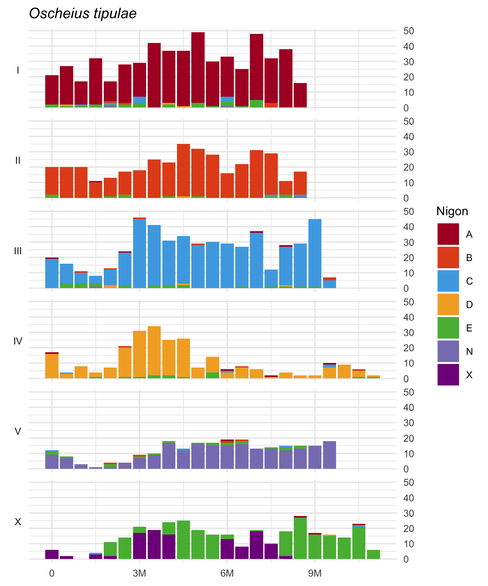

# Visualize Nigon units in Nematode assemblies

You need to run BUSCO on your genome assembly using the nematoda_odb10 dataset.
This script takes as input the resulting `full_table.tsv`.
You can now paint your genome by Nigons online. Simply upload your BUSCO full_table TSV file to [https://pgonzale60.shinyapps.io/vis_alg/](https://pgonzale60.shinyapps.io/vis_alg/). 

## Online painting

There are two variables that are important in the interpretation of the plot: the **bin size** and the **minimum number of loci**. These determine which, if any, scaffolds will be excluded from the plot. Small scaffolds are intentionally excluded as Nigons can only be meaningfully interpreted in multimegabase long sequences. 

The **bin size** determines at which span the BUSCO loci will be grouped. However, it also filters out scaffolds whose loci at the most distant part is less than twice the bin size. For example, if using a bin size of 500,000, and the assembly contains a scaffold with many BUSCO loci, but all of them found in only the first 900,000 basepairs of the sequence, this scaffold would be excluded from the plot.

The other filtering parameter is the **number of loci**. This one simply excludes scaffolds that have less than x number of BUSCO loci.

The **height** and **width** parameters do not affect the online plot. These only affect the PDF that we recommend you to download. Adjust the width and height of the PDF plot to fit the size of your scaffolds.

We do not have access to the files you upload. 

## Installation

If you prefer to create the plot locally, I recommend to install the dependencies via conda and to do so in a new conda environment to avoid conflicts with other packages.

``` shell
# Define name for new conda environment
ENV_NAME=vis_alg
# Create environment and install dependencies
conda create -n $ENV_NAME -c r -c conda-forge icu=58 r-dplyr=0.8 r-readr=1.3.1 r-scales=1.1.1 r-gtools=3.8.2  r-optparse=1.6.6 r-ggtext=0.1.0 xorg-libxrender=0.9.10 -y
# Activate conda environment
conda activate $ENV_NAME
```

Then get the script and the Nigon defintion found in this repository.

``` shell
git clone https://github.com/pgonzale60/vis_ALG.git
cd vis_ALG/
```

## Usage

You will need to specify the result of BUSCO and the location of the Nigon element dictionary.

``` shell
Rscript bin/vis_ALGs.R -b full_table.tsv -n data/gene2Nigon_busco20200927.tsv.gz -s Genus_species -o output.png
```

## Examples

There are two examples which you can use to test: *Caenorhabditis elegans* and *Oscheius tipulae* full_table.tsv resulting from BUSCO v4 using nematoda_odb10.

To generate a PNG image of the Nigon elements in *O. tipulae* chromosomes you can execute

``` shell
Rscript bin/vis_ALGs.R -b examples/oscheius_tipulae.local.v3_1rx.full_table.tsv -n data/gene2Nigon_busco20200927.tsv.gz -s Oscheius_tipulae -o otipu.png
```

To generate a JPEG image of the Nigon elements in *C. elegans* chromosomes you can execute

``` shell
Rscript bin/vis_ALGs.R -b examples/oscheius_tipulae.local.v3_1rx.full_table.tsv -n data/gene2Nigon_busco20200927.tsv.gz -s Caenorhabditis_elegans -o cele.jpeg
```

Example PNG *Oshceius tipulae* Nigon painting:


## Options

```
	-b FILE.TSV, --busco=FILE.TSV
		busco full_table.tsv file

	-n FILE.TSV, --nigon=FILE.TSV
		busco id assignment to Nigons [default=gene2Nigon_busco20200927.tsv.gz]

	-w INTEGER, --windowSize=INTEGER
		window size to bin the busco genes [default=500000]. Sequences shorter than twice this integer will not be shown in the plot

	-m INTEGER, --minimumGenesPerSequence=INTEGER
		sequences (contigs/scaffolds) with less than this number of busco genes will not be shown in the plot [default=15]

	-o FILE, --outPlot=FILE
		output image [default=Nigons.jpeg]. Should include one of the following extensions: eps, ps, tex, pdf, jpeg, tiff, png, bmp or svg

	--height=INTEGER
		height of plot. Increase this value according to the number of ploted sequences [default=6]

	--width=INTEGER
		width of plot [default=5]

	-s GENUS_SPECIES, --species=GENUS_SPECIES
		Title to be italicized in the plot [default=]

	-h, --help
		Show this help message and exit
```

## Citation

The nematoda ODB 10 loci assessed by BUSCO were classified into Nigons as described in 
Gonzalez de la Rosa, Pablo Manuel, et al. "A telomere-to-telomere assembly of *Oscheius tipulae* and the evolution of rhabditid nematode chromosomes." *G3* 11.1 (2021): jkaa020.
